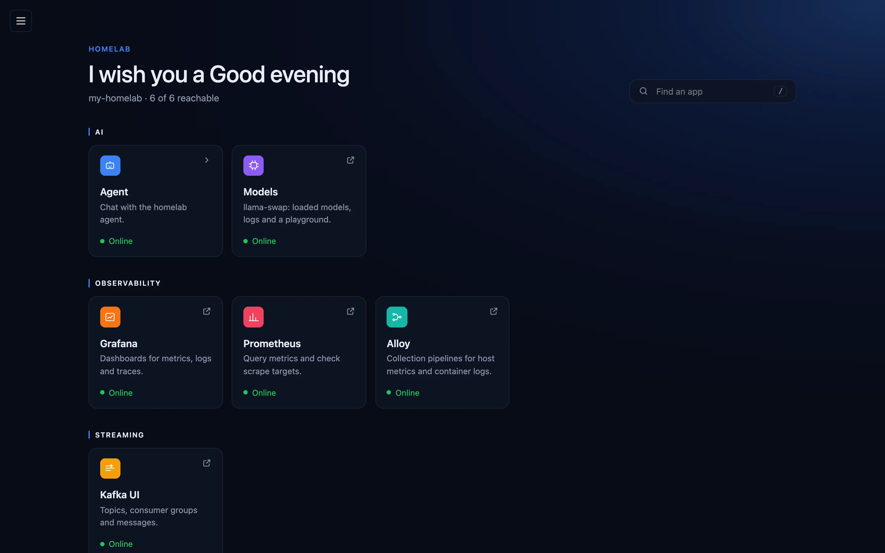
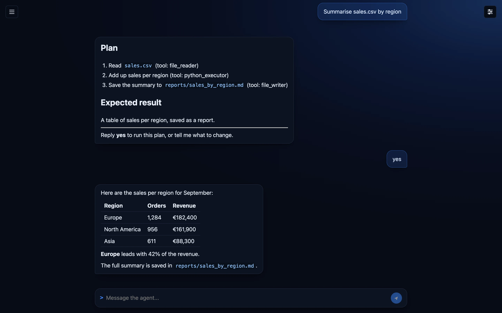
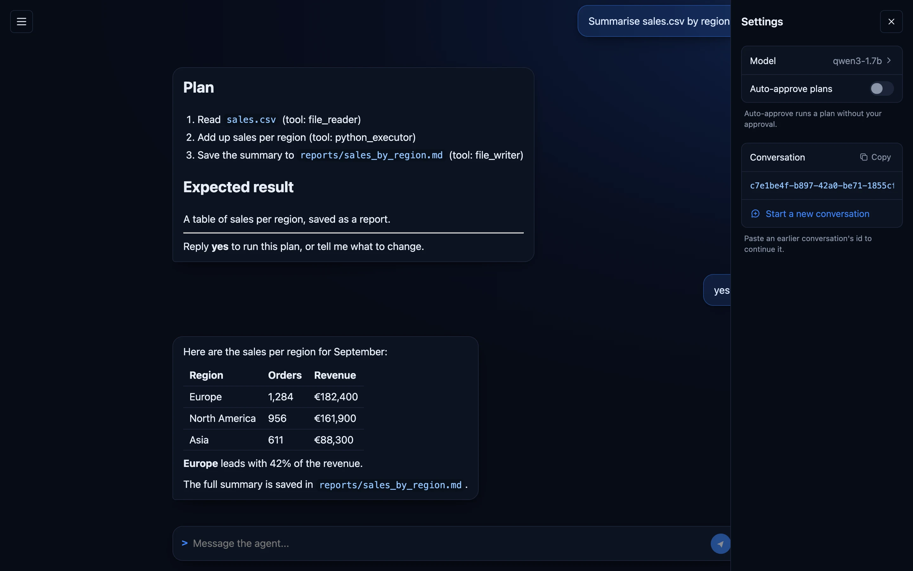
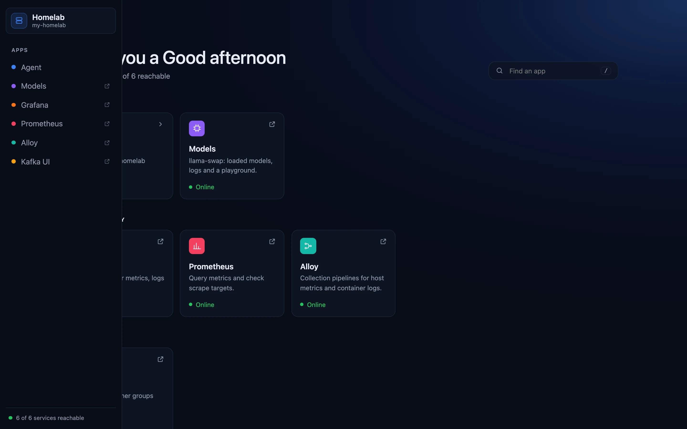
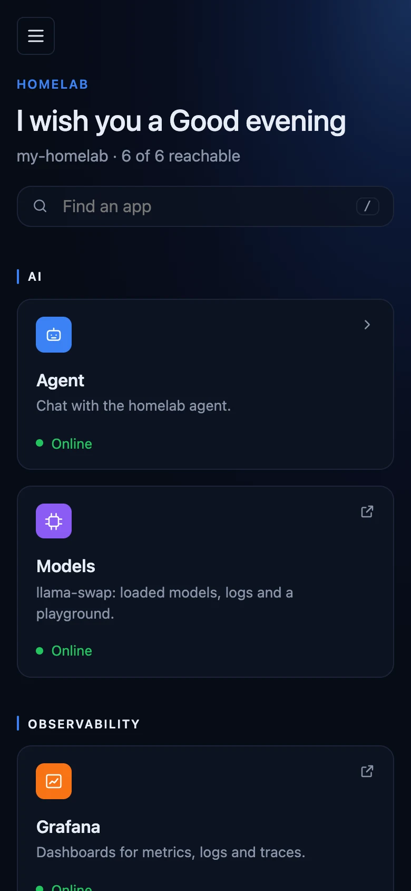
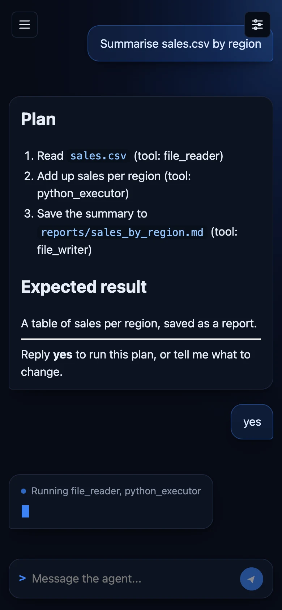

<div align="center">


# Homelab

**Everything running in your homelab, in one place — and an assistant that can do the work for you.**



</div>

## See everything at a glance

The overview lists every app in your homelab, grouped by what it does. Each tile tells you straight away whether the app is **online**, and one click opens it. Looking for something? Start typing in **Find an app** — or just press <kbd>/</kbd>.

## Ask the agent

Ask in plain words, the way you would ask a colleague: _"Summarise sales.csv by region"_, _"What's in change.md?"_, _"Which tools can you use?"_.

When a request needs real work — reading files, crunching numbers, saving a report — the agent first shows you **its plan**. Reply **yes** and it gets to work, showing what it is doing as it goes, then gives you the result.



## Stay in control

The settings panel lets you choose the **model** that answers, start a **new conversation**, or pick up an old one by pasting its id.

Trust the agent with a task? Turn on **Auto-approve plans** and it carries out its plans without waiting for your yes.



## All your tools, one menu away

The menu lists every app and page. Those that open in a new tab — dashboards, metrics, logs — are marked with a small arrow, and the bottom line tells you how many of your services are answering.



## On your phone too

The same experience on a small screen: check your services, or ask the agent something from the sofa.

<table>
  <tr>
    <td></td>
    <td></td>
  </tr>
</table>

## Open it

On any device connected to your homelab, open `http://<your-server>:<ui-port>` — the name of the machine running your homelab and the port the UI is published on.

---

## For developers

The dashboard UI for the homelab: a left sidebar for navigating between pages, a right sidebar for whatever the current page's settings are, and one page per homelab component (`agent` today, more later).

Built with Angular 21 (standalone components, signals) using a feature-first, layered structure: each page under `features/` owns its `domain` (types), `application` (state/orchestration), `infrastructure` (API clients), and `components`/`pages` (UI), and never reaches into another feature. Cross-cutting app chrome — the two sidebars, routing between pages — lives in `shell/`.

### Project structure

```
src/app/
├── app.ts / app.routes.ts       -- bootstraps <app-layout>, declares the routes
├── app.config.ts                -- the only place that lists the features (provideXxxFeature())
│
├── shell/                       -- app chrome; knows the feature contract, never a feature
│   ├── layout/                  -- left nav + <router-outlet> + right panel
│   ├── nav-sidebar/             -- left sidebar: Homelab (overview) + every app and page
│   ├── page-panel/              -- generic right sidebar host
│   ├── feature-icon/            -- draws the icon a feature hands over
│   ├── application/
│   │   ├── homelab-features.ts  -- HOMELAB_FEATURES + provideHomelabFeature()
│   │   ├── feature-status.store.ts  -- runs each feature's health check
│   │   ├── layout.store.ts      -- open/closed state of both sidebars
│   │   └── page-chrome.store.ts -- whatever the current page registered for the right panel
│   ├── directives/              -- [appPagePanelContent], how a page fills the right panel
│   └── domain/homelab-feature.ts  -- HomelabFeature: what a feature tells the shell
│
├── features/                    -- one folder per backend, even a plain link
│   ├── home/                    -- the dashboard: every feature by category, with health dots
│   ├── agent/                   -- chat page (reference example for a page)
│   │   ├── agent.feature.ts     -- registration
│   │   ├── domain/ application/ components/ pages/
│   │   └── infrastructure/
│   │       ├── agent.json       -- port + subpath of agent-orchestrator
│   │       └── api/             -- SSE client, readiness check
│   └── grafana/ prometheus/ alloy/ kafka-ui/ llm/   -- links to homelab-infra web UIs
│       ├── <name>.feature.ts    -- registration
│       └── infrastructure/<name>.json  -- port + subpath + health path
│
└── shared/
    ├── infrastructure/
    │   ├── homelab-server.json  -- the server where the homelab runs ("http://<your-server>")
    │   └── homelab-server.ts    -- builds every backend address from it
    └── pipes/
```

### Backend addresses

Every address is built from `shared/infrastructure/homelab-server.json` and the feature's own JSON:

| Feature JSON                             | Address                          |
| ---------------------------------------- | -------------------------------- |
| `{ "port": <port>, "subpath": null }`    | `http://<your-server>:<port>`    |
| `{ "port": <port>, "subpath": "ui" }`    | `http://<your-server>:<port>/ui` |
| `{ "port": null, "subpath": "grafana" }` | `http://<your-server>/grafana`   |

`healthPath` (optional) is what the status dot calls. The files are compiled in: rebuild after changing them. Every device opening the UI must be able to resolve the server name.

### Development

```bash
npm install
npm start           # dev server at http://localhost:4200, talking to the server in homelab-server.json
npm test            # vitest
npm run build        # production build to dist/homelab-ui
```

### Pre-commit hooks

`.pre-commit-config.yaml` runs typecheck, format-check, and tests before each commit and push. `pre-commit` itself is a standalone tool, not an npm package, so install it once, globally:

```bash
pipx install pre-commit   # or: brew install pre-commit / pip install pre-commit
```

Then wire it into this repo (or just run `make hooks`):

```bash
pre-commit install --hook-type pre-commit --hook-type pre-push
```

Run it manually against everything at any time:

```bash
pre-commit run --all-files
```

### Adding a page

Worked example: adding a `Metrics` page. Substitute your own name throughout (route path, feature id, folder name).

#### 1. Scaffold the feature folder

```
src/app/features/metrics/
├── domain/
├── application/
├── infrastructure/     (only if the page talks to a backend)
├── components/         (only once you have more than one presentational piece)
└── pages/metrics-page/
```

Skip any of `domain`/`application`/`infrastructure` the page doesn't need yet — `home` has none of them. Add a layer only when it actually has something to hold; an empty folder documents nothing.

#### 2. Build the page component

```ts
// features/metrics/pages/metrics-page/metrics-page.ts
import { Component } from '@angular/core';

@Component({
  selector: 'app-metrics-page',
  imports: [],
  templateUrl: './metrics-page.html',
  styleUrl: './metrics-page.scss',
})
export class MetricsPage {}
```

Give the page's `:host` this shape so it fills the space the shell gives it (see `agent-page.scss` or `home-page.scss` for the exact rule):

```scss
:host {
  display: flex;
  flex-direction: column;
  flex: 1 1 auto;
  min-height: 0;
  height: 100%;
  width: 100%;
}
```

#### 3. Register the route

```ts
// app.routes.ts
{
  path: 'metrics',
  loadComponent: () =>
    import('./features/metrics/pages/metrics-page/metrics-page').then((m) => m.MetricsPage),
},
```

Lazy (`loadComponent`) keeps each page its own bundle chunk — a new page never grows the main bundle.

#### 4. Register the feature

The left nav and the home dashboard list registered features. Add a registration next to the page:

```ts
// features/metrics/metrics.feature.ts
export function provideMetricsFeature(): Provider {
  return provideHomelabFeature(() => ({
    id: 'metrics',
    label: 'Metrics',
    description: 'Host and container metrics.',
    category: 'Observability',
    icon: ['M4 20V10M10 20V4M16 20v-7M22 20H2'],
    entry: { kind: 'page', path: '/metrics' },
  }));
}
```

and list it in `app.config.ts` (`provideMetricsFeature()`). If the page talks to a backend, give it `infrastructure/metrics.json` and a `checkHealth` (see `features/agent`).

A link to a homelab-infra web UI is the same, with `entry: { kind: 'link', url: server.url(ADDRESS) }` and no page or route (see `features/grafana`).

#### 5. Give it a right-sidebar panel (optional)

Only do this if the page has settings/controls that belong in the right sidebar. Wrap that content in `<ng-template appPagePanelContent>` inside the page's own template:

```html
<!-- metrics-page.html -->
<ng-template appPagePanelContent>
  <app-metrics-settings />
  <!-- or inline markup -- whatever the page's settings actually are -->
</ng-template>

<div class="metrics-page">... the page's main content ...</div>
```

```ts
import { PagePanelContentDirective } from '@shell/directives/page-panel-content.directive';

@Component({
  imports: [PagePanelContentDirective /* , ... */],
  // ...
})
export class MetricsPage {}
```

That's the entire contract: register the template, and the shell shows/hides the right sidebar and its mobile toggle automatically. Skip this step and the page simply has no right sidebar — that's how `home` works today.

#### 6. Verify

```bash
npm start
```

Open `http://localhost:4200` — the new page should appear in the left nav and as a tile on the home dashboard, `/metrics` should route to it, and (if step 5 was done) its settings should show in the right sidebar.

### Path aliases

`@shell/*`, `@features/*`, `@shared/*` (see `tsconfig.json`) resolve to `src/app/shell`, `src/app/features`, `src/app/shared`. Use them for cross-boundary imports (a feature importing shell code, for instance); use relative imports for anything within the same feature.
